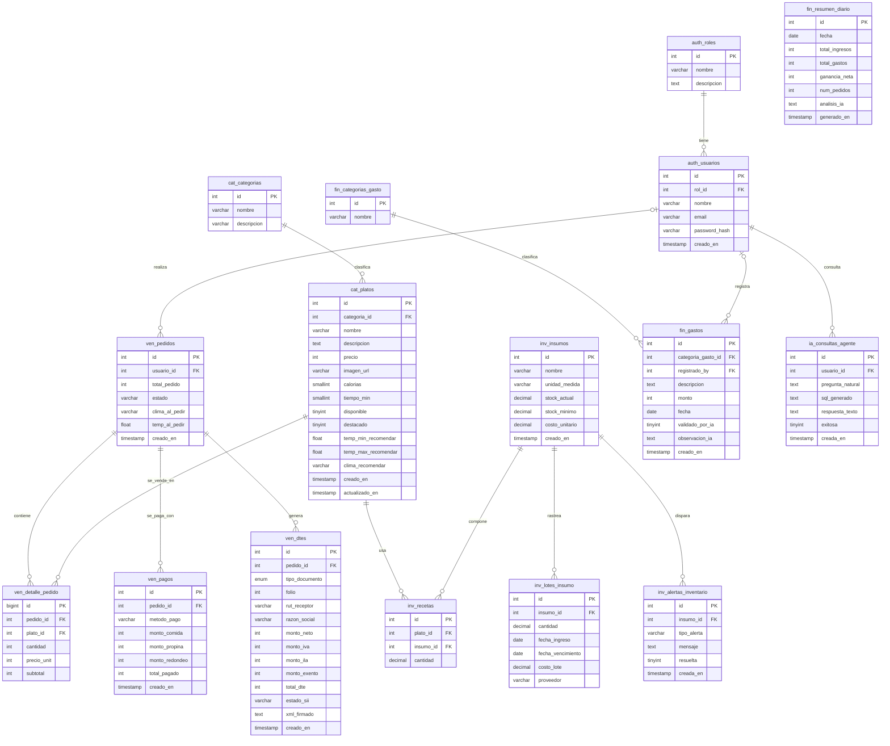

# 2. Diagrama Entidad-Relación (ERD) mediante Mermaid

Este documento contiene la visualización gráfica de la arquitectura de la base de datos de **Gastro-Sys-Fusion**, modelando las relaciones físicas y lógicas adaptadas al mercado de Chile.

---

