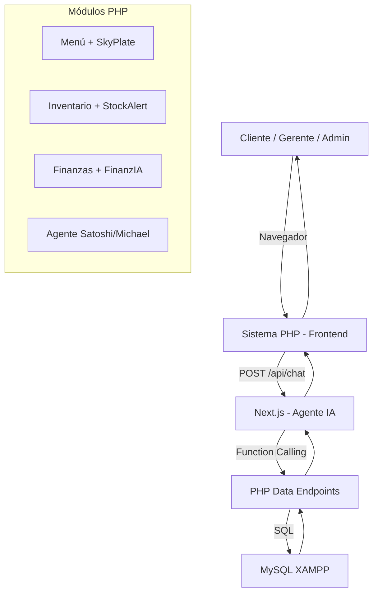

# 🍽️ Plan de Desarrollo — Plataforma Unificada de Gestión Gastronómica

### Arquitectura: Next.js (Agente IA) + PHP/MySQL XAMPP

---

## Arquitectura General



---

## 🏔️ Hito 0 — Fundación y Contratos (Semana 1)

> Definir las reglas antes de escribir código. Sin esto el equipo choca.
> 

### T0.1 — Diseño del Esquema de Base de Datos

Diseñar el esquema relacional unificado que comparten **todos los módulos**:

| Tabla | Módulos que la usan |
| --- | --- |
| `productos` / `platos` | Menú, Inventario, Finanzas |
| `recetas` (plato → insumos) | Inventario, Menú |
| `insumos` / `ingredientes` | Inventario |
| `lotes` (con fecha vencimiento) | Inventario |
| `proveedores` | Inventario |
| `ventas` / `pedidos` | Menú/E-commerce, Finanzas, Agente |
| `detalle_pedido` | Menú, Inventario (descuento auto) |
| `gastos` | Finanzas |
| `presupuestos` | Finanzas |
| `libro_mayor` | Finanzas |
| `historial_financiero` (auditoría) | Finanzas (US-4.4) |
| `usuarios` / `roles` | Todos |

**Reglas clave del esquema:**

- `recetas` vincula `platos` con `insumos` + cantidad requerida
- `lotes` tiene `fecha_vencimiento` y `cantidad_actual`
- `ventas` dispara descuento automático de `lotes` via trigger o lógica PHP
- `historial_financiero` registra usuario, timestamp y delta de cada cambio

### T0.2 — Contrato de API (documento vivo)

Crear `API_CONTRACT.md` con los endpoints que PHP expondrá a Next.js:

```
# Menú / SkyPlate
GET  /api/menu.php?clima={temp}&condicion={lluvia|sol|frio}
GET  /api/platos.php?disponible=true

# Inventario / StockAlert
GET  /api/inventario.php
GET  /api/inventario.php?alerta=stock_minimo
GET  /api/inventario.php?alerta=vencimiento&dias=3
GET  /api/mermas.php?periodo=semana
GET  /api/proveedores.php

# Finanzas / FinanzIA
GET  /api/finanzas/resumen.php?fecha=YYYY-MM-DD
GET  /api/finanzas/gastos.php?categoria=X
GET  /api/finanzas/presupuestos.php
GET  /api/finanzas/auditoria.php?desde=X&hasta=Y
POST /api/finanzas/gastos.php   (registrar gasto manual)

# Agente (Next.js → PHP bridge seguro)
POST /api/agente/query.php      (recibe SQL validado, ejecuta solo SELECT)
```

**Formato estándar de respuesta:**

```json
{
  "success": true,
  "data": [],
  "meta": { "total": 0, "generado_en": "ISO8601" },
  "error": null
}
```

**Endpoint del Agente (Next.js):**

```
POST <http://localhost:3000/api/chat>
Body:    { "message": "string", "session_id": "uuid" }
Response:{ "reply": "string", "tool_used": "string|null", "data": {} }
```

### T0.3 — Setup de Entornos

- XAMPP corriendo en `localhost:3306` + Apache `localhost:80`
- Next.js en `localhost:3000`
- `.env.local` de Next.js:
    
    ```
    GEMINI_API_KEY=...
    PHP_API_BASE_URL=http://localhost/gastro-sys/api
    WEATHER_API_KEY=...   # OpenWeatherMap o similar
    ```
    
- Headers CORS en PHP para permitir `localhost:3000`
- Mocks JSON de cada endpoint para desarrollo en paralelo

### T0.4 — Datos de Prueba

- Poblar MySQL con datos realistas: 15+ platos, 30+ insumos, ventas de los últimos 60 días, gastos históricos
- Incluir escenarios de prueba: lotes próximos a vencer, stock bajo, pagos duplicados

**✅ Criterio Hito 0:** Esquema aprobado por el equipo, mocks disponibles, ambos servidores corren.

---

## 🔌 Hito 1 — Módulo Menú Inteligente + E-commerce (Semanas 1–2)

*Basado en: SkyPlate + DIcreme | US-1.1 a US-1.5*

### T1.1 — Integración API del Clima (US-1.1)

- Crear `lib/clima.php` que consulte OpenWeatherMap con la ciudad del restaurante
- Exponer `/api/clima.php` → devuelve `{ temperatura, condicion, descripcion }`
- Motor de reglas de recomendación:

```php
// Lógica de recomendación por temperatura
if ($temp < 15) → destacar: sopas, guisos, bebidas calientes
if ($temp > 25) → destacar: ensaladas, ceviches, bebidas frías
if ($condicion == "lluvia") → destacar: platos comfort, caldos
```

### T1.2 — Endpoint de Menú Dinámico (US-1.1, US-5.1)

- `/api/menu.php` aplica filtro de clima y filtra platos con estado `agotado`
- Campo `recomendado_por_clima: true/false` en la respuesta
- Solo devuelve platos con `disponible = true` Y stock suficiente en receta

### T1.3 — Interfaz de Carta Digital (US-1.1, US-1.2, US-1.3)

- Página `menu.php` con sección "Destacados hoy" (filtrada por clima)
- Grilla de categorías y platos con foto, descripción, precio
- Modal de personalización por plato: modificadores + campo de notas libres (US-1.3)
- Diseño responsive, orientado al cliente final

### T1.4 — Carrito y Flujo de Compra (US-1.2)

- Carrito persistido en `sessionStorage`
- Resumen de pedido con subtotal, IVA, total
- Formulario de datos del cliente (nombre, mesa o retiro)
- Botón "Confirmar Pedido" → POST a `/api/pedidos.php` → crea venta en MySQL

### T1.5 — Notificación de Pedido Listo (US-1.4)

- Al cambiar estado del pedido a `listo`, enviar notificación
- Opciones: email via `mail()` PHP o webhook a sistema de mensajería
- Dashboard de cocina: vista de pedidos activos con estado y tiempo transcurrido

### T1.6 — Historial de Pedidos del Cliente (US-1.5)

- Tabla `clientes` con identificación por email o teléfono
- Página `mis-pedidos.php`: listado cronológico con botón "Pedir nuevamente"
- Repobla el carrito con los items del pedido anterior

**✅ Criterio Hito 1:** Flujo completo cliente → pedido confirmado funciona. Menú se adapta al clima. Platos agotados no aparecen.

---

## 📦 Hito 2 — Módulo de Inventario y Alertas (Semanas 2–3)

*Basado en: StockAlert | US-2.1 a US-2.4, US-5.1*

### T2.1 — Endpoints de Inventario

**`/api/inventario.php`**

- Lista todos los insumos con `stock_actual`, `stock_minimo`, `unidad`
- Campo `alerta_stock: true` si `stock_actual <= stock_minimo`

**`/api/inventario.php?alerta=vencimiento&dias=3`** (US-2.2)

- Devuelve lotes cuya `fecha_vencimiento` esté dentro de N días
- Ordenados por urgencia

**`/api/mermas.php?periodo=semana`** (US-2.3)

- Top 5 insumos con más bajas por merma en el período
- Cantidad perdida y costo estimado de la pérdida

### T2.2 — Dashboard de Inventario (US-2.1, US-2.2)

- Tabla de insumos con semáforo visual (verde/amarillo/rojo según stock)
- Panel de alertas de vencimiento: "⚠️ El tomate [Lote #4] vence en 2 días"
- Alertas aparecen en el dashboard principal del sistema

### T2.3 — Reporte de Mermas (US-2.3)

- Vista `inventario/mermas.php`
- Gráfico de barras: top 5 insumos perdidos de la semana
- Formulario para registrar una merma manual (insumo, cantidad, motivo)

### T2.4 — CRUD de Proveedores e Historial de Compras (US-2.4)

- `proveedores.php`: crear, editar, eliminar proveedores
- Asociación insumo → proveedor principal
- Registro de órdenes de compra con fecha, cantidad y precio por unidad

### T2.5 — Descuento Automático de Stock por Venta (US-5.1)

- Al confirmar un pedido, PHP recorre la `receta` de cada plato vendido
- Descuenta la cantidad correspondiente de cada `lote` (FIFO: primero vence primero)
- Si `stock_actual` cae a 0, actualiza el plato a `disponible = false` (estado `agotado`)
- El menú dinámico (T1.2) ya filtra platos agotados automáticamente

**✅ Criterio Hito 2:** Alertas de stock y vencimiento aparecen en dashboard. Pedido confirmado descuenta inventario. Plato se marca agotado automáticamente.

---

## 💰 Hito 3 — Módulo de Auditoría Financiera (Semanas 3–4)

*Basado en: FinanzIA | US-3.1 a US-3.3, US-4.4, US-4.5*

### T3.1 — Sincronización Automática Ventas → Finanzas (US-3.1)

- Al confirmar un pedido, PHP registra automáticamente en `libro_mayor`:
    - Tipo: `ingreso`
    - Categoría: `venta_directa`
    - Monto, fecha, referencia al pedido
- Zero intervención manual para ingresos de ventas

### T3.2 — Registro Manual de Gastos + Feedback IA (US-3.2)

- Formulario `finanzas/gastos.php`: categoría, monto, descripción, fecha
- Al guardar, Next.js calcula el impacto en el margen del día:
    - Llama a `/api/finanzas/resumen.php?fecha=hoy`
    - Gemini devuelve: "Este gasto representa el X% del margen del día. El margen neto estimado es Y%."
- Resultado mostrado inline en el formulario

### T3.3 — Gestión de Presupuestos Mensuales (US-3.3)

- Interfaz para cargar presupuesto por categoría (arriendo, insumos, personal, etc.)
- Comparativo en tiempo real: presupuestado vs. ejecutado
- Alerta visual (rojo) cuando una categoría supera el 90% del presupuesto

### T3.4 — Historial de Auditoría Financiera (US-4.4)

- Toda modificación financiera registra en `historial_financiero`:
    - `usuario_id`, `accion`, `tabla_afectada`, `valor_anterior`, `valor_nuevo`, `timestamp`
- Vista `finanzas/auditoria.php`:
    - Filtros por tipo de movimiento, usuario, rango de fechas
    - Exportación a PDF y Excel (usando `dompdf` para PDF, `PhpSpreadsheet` para Excel)

### T3.5 — Detección de Pagos Duplicados e Inconsistencias (US-4.5)

- Script PHP que verifica periódicamente:
    - Mismo monto + mismo proveedor + misma fecha → alerta de duplicado
    - Diferencias entre suma de `detalle_pedido` y total registrado en `ventas`
- Panel de alertas contables en el dashboard financiero
- Historial de validaciones realizadas con resultado y fecha

**✅ Criterio Hito 3:** Ventas se sincronizan solas. Auditoría registra todos los cambios. Duplicados detectados con alerta visible. Exportación PDF/Excel funciona.

---

## 🤖 Hito 4 — Agente IA en Next.js (Semanas 3–5)

*Basado en: Satoshi/Michael | US-4.1 a US-4.3*

### T4.1 — Setup del Proyecto Next.js

```
agente-restaurante/
├── app/api/chat/route.ts        ← Endpoint del agente
├── lib/
│   ├── gemini.ts                ← Cliente Gemini Flash
│   ├── tools.ts                 ← Function Calling definitions
│   └── php-client.ts            ← Fetchers tipados a endpoints PHP
├── .env.local
└── README.md
```

### T4.2 — Definición de Tools (Function Calling)

```tsx
// lib/tools.ts — herramientas disponibles para Gemini
export const tools = [
  {
    name: "consultar_ventas",
    description: "Ventas e ingresos del restaurante en un rango de fechas.",
    parameters: {
      desde: { type: "string", description: "YYYY-MM-DD" },
      hasta:  { type: "string", description: "YYYY-MM-DD" }
    }
  },
  {
    name: "consultar_inventario",
    description: "Stock actual de insumos, alertas de mínimos y vencimientos."
  },
  {
    name: "consultar_menu",
    description: "Carta actual con disponibilidad y recomendaciones por clima."
  },
  {
    name: "consultar_finanzas",
    description: "Resumen financiero: ingresos, gastos, margen. Acepta parámetro fecha.",
    parameters: {
      fecha: { type: "string" },
      tipo:  { type: "string", enum: ["diario","mensual","comparativo"] }
    }
  },
  {
    name: "consultar_mermas",
    description: "Reporte de mermas semanales con top 5 de insumos desperdiciados."
  },
  {
    name: "consultar_pedidos",
    description: "Pedidos activos por estado: pendiente, en_cocina, listo.",
    parameters: {
      estado: { type: "string", enum: ["pendiente","en_cocina","listo"] }
    }
  },
  {
    name: "reporte_comparativo_mensual",
    description: "Compara ventas y costos del mes actual vs el mes anterior. Úsala para cierres mensuales.",
    parameters: {
      mes:  { type: "number" },
      anio: { type: "number" }
    }
  }
]
```

### T4.3 — Sistema Prompt del Agente

```tsx
// lib/gemini.ts
const systemPrompt = `
Eres el Asistente de Inteligencia de [NOMBRE RESTAURANTE].
Tienes acceso en tiempo real a: ventas, inventario, menú, finanzas, mermas y pedidos.

REGLAS:
- Responde siempre en español, de forma concisa y útil para el personal.
- Cuando necesites datos, usa las herramientas disponibles.
- NUNCA ejecutes ni sugieras operaciones de escritura (INSERT/UPDATE/DELETE).
- Solo analiza y reporta; no tomes decisiones autónomas sobre el negocio.
- Si la pregunta está fuera del dominio del restaurante, indícalo amablemente.
- Para consultas de datos históricos, siempre indica el período analizado.

Hoy es: ${new Date().toLocaleDateString('es-CL')}.
`
```

### T4.4 — Endpoint Principal y Loop del Agente (US-4.1, US-4.2)

```tsx
// app/api/chat/route.ts — loop de Function Calling
export async function POST(req: Request) {
  const { message, history, session_id } = await req.json()

  const chat = model.startChat({ history: getHistory(session_id) })
  let result = await chat.sendMessage(message)

  // Loop: Gemini puede encadenar múltiples tool calls
  while (result.response.functionCalls()?.length > 0) {
    const calls = result.response.functionCalls()
    const toolResults = await Promise.all(calls.map(executeTool))
    result = await chat.sendMessage([{ functionResponse: toolResults }])
  }

  saveHistory(session_id, message, result.response.text())

  return Response.json({
    reply: result.response.text(),
    tool_used: lastToolUsed
  })
}
```

**Seguridad (US-4.2):**

- El agente **nunca** toca MySQL directamente
- Toda consulta va a través de endpoints PHP que solo ejecutan `SELECT`
- El endpoint PHP `/api/agente/query.php` valida que el SQL no contenga `DROP/DELETE/UPDATE/INSERT`

### T4.5 — Reporte Comparativo Mensual Automático (US-4.3)

- Cron job en PHP (via XAMPP Task Scheduler) que se ejecuta el último día del mes
- Llama al endpoint del agente con: `"Genera el reporte comparativo del mes"`
- El agente invoca `reporte_comparativo_mensual` → obtiene datos → genera resumen
- El resumen se guarda en la BD y se muestra en el chat del gerente al login del día siguiente

### T4.6 — Interfaz del Chat en PHP (US-4.1)

- Widget flotante en el layout principal del sistema PHP
- Solo visible para roles: Gerente, Administrador
- `chat.js` maneja:
    - Envío de mensajes a `localhost:3000/api/chat`
    - Session ID en `localStorage`
    - Renderizado de Markdown (usando `marked.js`)
    - Loading state "✦ Analizando..."
- Sugerencias de preguntas predefinidas:
    - "¿Cuánto vendimos hoy?"
    - "¿Qué insumos están por agotarse?"
    - "¿Cuál fue el plato más vendido esta semana?"
    - "Muéstrame el margen de esta semana"

**✅ Criterio Hito 4:** El agente responde correctamente a las 10 preguntas de prueba definidas. Solo lectura confirmada. Reporte mensual automático funciona.

---

## 🔗 Hito 5 — Integración E2E, Seguridad y Demo (Semana 5)

### T5.1 — Suite de Pruebas de Integración

| # | Pregunta / Acción | Módulo | Resultado esperado |
| --- | --- | --- | --- |
| 1 | Cliente hace pedido con plato agotado | Menú | Plato no aparece en carta |
| 2 | Pedido confirmado → inventario descuenta | Inventario | Stock reducido, alerta si llega a mínimo |
| 3 | Stock llega a 0 → plato se oculta | Inventario+Menú | Estado `agotado` automático |
| 4 | "¿Cuánto vendimos hoy?" al agente | Agente | Monto correcto del día |
| 5 | "¿Qué insumos vencen esta semana?" | Agente | Lista con fechas |
| 6 | Venta registrada → finanzas actualiza | Finanzas | Libro mayor con nuevo ingreso |
| 7 | Gasto manual → alerta de presupuesto | Finanzas | Alerta si supera 90% |
| 8 | Pago duplicado ingresado | Finanzas | Alerta de inconsistencia |
| 9 | Reporte comparativo mensual | Agente | Resumen lenguaje natural |
| 10 | Clima frío → sopas destacadas | Menú | Sección "Destacados" correcta |

### T5.2 — Seguridad Básica

- PDO con prepared statements en todos los endpoints PHP (prevenir SQL Injection)
- Rate limiting en Next.js: máx 20 requests/minuto por `session_id`
- Validación de `session_id` como UUID válido
- La `GEMINI_API_KEY` nunca sale del servidor Next.js
- Roles y permisos en PHP: el chat del agente solo para Gerente/Admin
- Endpoint `/api/agente/query.php` bloquea sentencias no-SELECT

### T5.3 — Documentación Final

- `README.md` con instrucciones de instalación (XAMPP + Next.js) en < 10 pasos
- `API_CONTRACT.md` actualizado con respuestas reales (no mocks)
- Guía de uso del agente: qué puede y qué no puede responder

### T5.4 — Pulido UX

- Sugerencias de preguntas en el chat del agente
- Alertas de inventario y finanzas consolidadas en un panel único en el dashboard
- Animaciones de loading en todos los estados de espera
- Feedback visual al completar acciones (toast notifications)

### T5.5 — Preparación de Demo

- Script de demo con secuencia de impacto:
    1. Cliente hace pedido → inventario se descuenta en vivo
    2. Stock llega a mínimo → alerta aparece en dashboard
    3. Gerente pregunta al agente → responde con datos reales
    4. Clima frío → menú muestra sopas destacadas
- Backup de BD con datos realistas para la demo
- Prueba en entorno limpio (XAMPP + Next.js recién instalados)

**✅ Criterio Hito 5:** 10/10 pruebas pasan. Demo funciona sin errores en entorno limpio.

---

## 📅 Timeline

```
Semana 1:  [H0] Fundación + Contratos + BD
           [H1] Inicio Menú + Clima

Semana 2:  [H1] E-commerce completo
           [H2] Inicio Inventario

Semana 3:  [H2] Inventario completo
           [H3] Inicio Finanzas
           [H4] Inicio Agente Next.js

Semana 4:  [H3] Finanzas completo
           [H4] Agente completo

Semana 5:  [H5] Integración E2E + Seguridad + Demo
```

---

## 🗂️ Estructura de Archivos

```
gastro-sys/ (PHP - XAMPP)
├── api/
│   ├── db.php / response.php       ← helpers base
│   ├── menu.php / clima.php
│   ├── inventario.php / mermas.php / proveedores.php
│   ├── pedidos.php
│   ├── finanzas/
│   │   ├── resumen.php / gastos.php
│   │   ├── presupuestos.php / auditoria.php
│   └── agente/
│       └── query.php               ← bridge seguro solo-lectura
├── assets/js/chat.js
├── menu.php / mis-pedidos.php
├── inventario/ / finanzas/ / dashboard.php
└── config.php / .htaccess

agente-restaurante/ (Next.js)
├── app/api/chat/route.ts
├── lib/
│   ├── gemini.ts / tools.ts
│   └── php-client.ts
├── .env.local / .env.example
└── README.md
```

---

> [!IMPORTANT]
**Dependencia crítica:** El esquema de BD (T0.1) y el API_CONTRACT.md (T0.2) deben estar cerrados antes de que cualquier otro hito avance. Todo el sistema comparte las mismas tablas.
> 

> [!TIP]
**Paralelismo posible:** Con los mocks del Hito 0 listos, el Agente (H4) puede desarrollarse desde la Semana 3 en paralelo con Finanzas (H3), sin esperar los endpoints PHP reales.
>